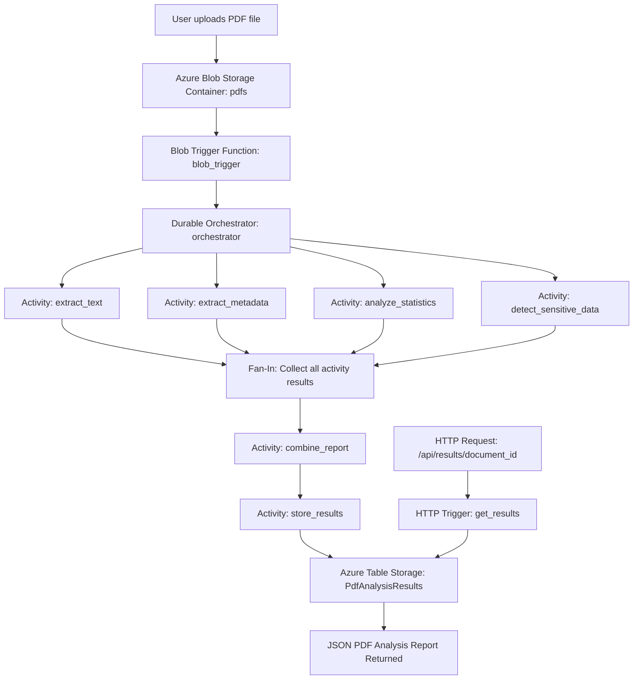

# CST8917 Midterm Project – Smart PDF Analyzer with Durable Functions

## Project Overview

This project is a serverless PDF analysis system built with Azure Durable Functions. The application automatically processes PDF documents uploaded to Azure Blob Storage. When a PDF is uploaded into the `pdfs` container, a Blob Trigger starts a Durable Functions orchestration.

The orchestrator uses the Fan-Out/Fan-In pattern to run four PDF analysis activities in parallel:

1. Extract text from the PDF
2. Extract PDF metadata
3. Analyze document statistics
4. Detect sensitive data

After all four activities complete, the results are combined into one report, stored in Azure Table Storage, and made available through an HTTP endpoint.

## Team Members

- Thomas de Haan Carrière
- Vijay
- Ilyas Zazai

## Azure Resources

The project was deployed to Microsoft Azure using the following resources:

| Azure Resource | Name | Purpose |
|---|---|---|
| Resource Group | `CST8917-Midterm` | Contains all Azure resources for the project |
| Function App | `pdf-analyzer-vijay` | Hosts and runs the Azure Functions application |
| Storage Account | `pdfanalyzervijay` | Stores uploaded PDFs, Durable Functions runtime data, and Table Storage results |
| Blob Container | `pdfs` | Input container where PDF files are uploaded |
| Table Storage | `PdfAnalysisResults` | Stores the final PDF analysis reports |
| Application Insights | `pdf-analyzer-vijay` | Provides logs, monitoring, and function execution information |
| App Service Plan | `CanadaCentralLinuxDynamicPlan` | Hosts the Linux Consumption Function App |

## Architecture Diagram



## Application Flow

1. A PDF file is uploaded to the Azure Blob Storage container named `pdfs`.
2. The `blob_trigger` function detects the new PDF upload.
3. The Blob Trigger starts the Durable Functions `orchestrator`.
4. The orchestrator runs four activity functions in parallel:
   - `extract_text`
   - `extract_metadata`
   - `analyze_statistics`
   - `detect_sensitive_data`
5. After the four activities finish, the orchestrator performs the fan-in step.
6. The `combine_report` activity creates one unified report from all activity results.
7. The `store_results` activity saves the final report into Azure Table Storage.
8. The `get_results` HTTP endpoint retrieves the stored analysis result by `document_id`.

## Function List

| Function Name | Trigger Type | Purpose |
|---|---|---|
| `blob_trigger` | Blob Trigger | Detects PDF uploads in the `pdfs` container and starts the orchestration |
| `orchestrator` | Orchestration Trigger | Coordinates the Fan-Out/Fan-In workflow |
| `extract_text` | Activity Trigger | Extracts text content from all PDF pages |
| `extract_metadata` | Activity Trigger | Extracts PDF metadata such as title, author, creator, producer, creation date, and modification date |
| `analyze_statistics` | Activity Trigger | Calculates page count, word count, average words per page, and estimated reading time |
| `detect_sensitive_data` | Activity Trigger | Detects emails, phone numbers, URLs, and date patterns |
| `combine_report` | Activity Trigger | Combines all four analysis results into one final report |
| `store_results` | Activity Trigger | Stores the final report in Azure Table Storage |
| `get_results` | HTTP Trigger | Retrieves a stored PDF analysis report using the document ID |

## Durable Functions Pattern

This project uses a hybrid Durable Functions pattern:

### Fan-Out

The orchestrator starts four PDF analysis activities at the same time:

- `extract_text`
- `extract_metadata`
- `analyze_statistics`
- `detect_sensitive_data`

### Fan-In

The orchestrator waits until all four activities finish, then collects their results.

### Chaining

After fan-in, the workflow continues with two sequential steps:

1. `combine_report`
2. `store_results`

The final report can then be retrieved through the `get_results` HTTP endpoint.

## Final Report and Storage Design

The final report is created by the `combine_report` activity. It includes:

- `document_id`
- `blob_name`
- `uploaded_at`
- `processed_at`
- `text_extraction`
- `metadata`
- `statistics`
- `sensitive_data`

The report is stored in Azure Table Storage in the `PdfAnalysisResults` table.

| Table Field | Description |
|---|---|
| `PartitionKey` | Uses `pdf-reports` for stored PDF reports |
| `RowKey` | Uses the unique `document_id` |
| `blob_name` | Name of the uploaded PDF file |
| `uploaded_at` | Time when the PDF was uploaded |
| `processed_at` | Time when the analysis report was completed |
| `text_extraction` | JSON string containing extracted PDF text |
| `metadata` | JSON string containing PDF metadata |
| `statistics` | JSON string containing page count, word count, and reading time |
| `sensitive_data` | JSON string containing detected emails, phone numbers, URLs, and dates |

The `document_id` is used as the `RowKey`, which allows the HTTP endpoint to retrieve the correct PDF analysis report.

## HTTP Results Endpoint

The HTTP endpoint retrieves the stored PDF analysis result from Azure Table Storage.

### Local endpoint

```http
GET http://localhost:7071/api/results/{document_id}
```

### Azure endpoint

```http
GET https://pdf-analyzer-vijay.azurewebsites.net/api/results/{document_id}
```

Replace `{document_id}` with the actual RowKey/document ID from the `PdfAnalysisResults` table.

## Example JSON Response

```json
{
  "document_id": "example-document-id",
  "blob_name": "example.pdf",
  "uploaded_at": "2026-06-27T20:00:00Z",
  "processed_at": "2026-06-27T20:00:10Z",
  "text_extraction": {
    "full_text": "Extracted text from the PDF...",
    "page_texts": ["Page 1 text", "Page 2 text"],
    "page_count": 2
  },
  "metadata": {
    "title": "Example PDF",
    "author": "Example Author",
    "creator": "Example Creator",
    "producer": "Example Producer",
    "creation_date": "D:20260325201452+00'00'",
    "modification_date": "D:20260325201452+00'00'"
  },
  "statistics": {
    "page_count": 2,
    "word_count": 389,
    "avg_words_per_page": 194.5,
    "estimated_reading_time_minutes": 1.63
  },
  "sensitive_data": {
    "emails": ["example@algonquinlive.com"],
    "phone_numbers": ["(613) 400-6260"],
    "urls": [],
    "dates": ["March 25, 2026"],
    "summary": {
      "email_count": 1,
      "phone_count": 1,
      "url_count": 0,
      "date_count": 1,
      "total_findings": 3
    }
  }
}
```

## Required Files

| File | Purpose |
|---|---|
| `function_app.py` | Main Azure Functions implementation containing all 9 functions |
| `requirements.txt` | Python package dependencies |
| `local.settings.example.json` | Safe template for local settings without real connection strings |
| `test-function.http` | REST Client file for testing the HTTP results endpoint |
| `README.md` | Project documentation, setup steps, architecture diagram, contribution statement, demo link, and AI disclosure |

## Local Setup Instructions

### 1. Clone the repository

```bash
git clone https://github.com/thomas7carriere/CST8917_PDF-Analyzer-using-Durable-Functions.git
cd CST8917_PDF-Analyzer-using-Durable-Functions
```

### 2. Create a Python virtual environment

```bash
python3 -m venv .venv
source .venv/bin/activate
```

For Windows PowerShell:

```powershell
python -m venv .venv
.venv\Scripts\Activate.ps1
```

### 3. Install dependencies

```bash
pip install -r requirements.txt
```

### 4. Configure local settings

Copy the example settings file:

```bash
cp local.settings.example.json local.settings.json
```

Update `local.settings.json` with the required local values.

For local Azurite testing, development storage can be used.

Important: do not commit `local.settings.json` because it may contain real connection strings or secrets.

### 5. Start Azurite

Start Azurite before running the Function App. Blob, Queue, and Table services must be available because Durable Functions and Azure Storage are used.

### 6. Start the Azure Functions app locally

```bash
func start
```

### 7. Upload a PDF locally

Upload a PDF file into the local Azurite Blob Storage container named:

```text
pdfs
```

The `blob_trigger` function should detect the uploaded PDF and start the Durable Functions workflow.

### 8. Retrieve the result locally

Use the document ID generated by the workflow and call:

```http
GET http://localhost:7071/api/results/{document_id}
```

The `test-function.http` file can also be used to test the endpoint.

## Azure Deployment and Testing

The project was deployed to Azure using the Function App:

```text
pdf-analyzer-vijay
```

### Azure test flow

1. Upload a PDF to the Azure Blob Storage container:

```text
pdfs
```

2. The `blob_trigger` function detects the uploaded PDF.
3. The Durable Functions `orchestrator` starts.
4. The four PDF analysis activities run in parallel.
5. The final report is created by `combine_report`.
6. The final report is saved by `store_results`.
7. The result is stored in the `PdfAnalysisResults` table.
8. The result is retrieved using:

```http
GET https://pdf-analyzer-vijay.azurewebsites.net/api/results/{document_id}
```

## Demo Video

YouTube demo link:

```text
ADD_YOUTUBE_DEMO_LINK_HERE
```

The demo video covers:

- Local PDF upload to Azurite
- Blob trigger firing locally
- Parallel execution of the four analysis activities
- Results retrieval using the HTTP endpoint
- Azure deployment
- PDF upload in Azure Blob Storage
- Stored result in Azure Table Storage
- Cloud HTTP endpoint result retrieval
- Code walkthrough by all team members

## Contribution Statement

| Team Member | Contribution |
|---|---|
| Thomas de Haan Carrière | Worked on the Azure Durable Functions implementation, including workflow structure, Blob Trigger, orchestrator, PDF analysis functions, and repository updates. |
| Vijay | Worked on Azure deployment, cloud testing, Azure Storage configuration, Table Storage verification, HTTP endpoint testing, and validation of deployed results. |
| Ilyas Zazai | Worked on the final reporting and retrieval section, including understanding and explaining `combine_report`, `store_results`, and `get_results`. Also prepared the README documentation, architecture diagram, setup instructions, contribution statement, AI disclosure, and demo explanation for the storage and retrieval flow. |

All team members reviewed the project flow and participated in preparing the final demo.

## AI Disclosure

AI was used for clean coding support, documentation improvement, README structure, and explanation of the Azure Durable Functions workflow. The team reviewed and verified the final code, documentation, and demo content before submission.

## Security Note

Real Azure connection strings, account keys, API keys, and `local.settings.json` must not be committed to GitHub.

This repository includes:

```text
local.settings.example.json
```

as a safe template only.

The actual local settings file should remain local and should be ignored by Git.

